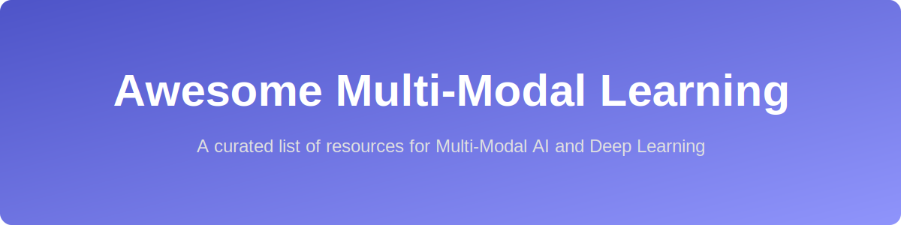
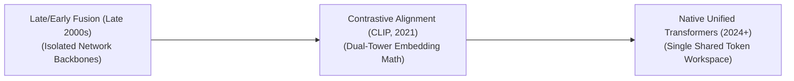

  
   
   
  
  

# 🌟 Awesome-Multi-Modal-Learning
## 🧠 Multi-Modal Learning: Evolution, Variants, Types, & Applications

Multi-Modal Learning is a subfield of machine learning that enables AI systems to process, relate, and fuse information from multiple distinct modalities—such as text, images, video, audio, and sensor data. By breaking away from uni-modal constraints, multi-modal models achieve a more holistic, human-like understanding of real-world environments.

---

## 🕰️ 1. The Chronological Evolution

The progression of Multi-Modal Learning reflects a transition from rigid, hand-crafted fusion frameworks to unified, fluid token spaces capable of generating cross-modal outputs.

| Era/Concept | Concept Description | Year | First/Key Paper |
| :--- | :--- | :--- | :--- |
| [**The Feature Fusion Era** (Late 2000s–2010s)](pages/feature-fusion-era.md) | Modalities were processed by completely separate networks (e.g., CNNs for images, LSTMs for text). The data vectors were combined only at the very beginning (Early Fusion) or at the very end (Late Fusion) of the network pipeline. | 2011 | [Multimodal Deep Learning](https://icml.cc/2011/papers/399_icmlpaper.pdf) |
| [**The Contrastive Alignment Era** (CLIP Era, ~2021–2023)](pages/contrastive-alignment-era.md) | Popularized by OpenAI's CLIP. Rather than merging modalities, it trained a dual-tower network (Image Tower + Text Tower) to push matching text and image vectors close together in a shared vector space, unlocking zero-shot classification. | 2021 | [Learning Transferable Visual Models From Natural Language Supervision](https://arxiv.org/abs/2103.00020) |
| [**The Native Unified Token Era** (~2024–Present)](pages/native-unified-token-era.md) | Pioneered by modern frontier models (like GPT-4o, Gemini 1.5, or Claude 3.5 Sonnet). Images, audio waves, and text characters are patchified/tokenized immediately and fed directly into a single, massive Transformer backbone, processing all modalities natively and simultaneously. | 2023 | [Gemini: A Family of Highly Capable Multimodal Models](https://arxiv.org/abs/2312.11805) |

---

## ⚙️ 2. Multi-Modal Interaction & Alignment Types

These variants define how separate modalities interact mathematically within the hidden layers of a machine learning system.

| Variant | Mechanism / Behavior / Example | Year | First/Key Paper |
| :--- | :--- | :--- | :--- |
| [**Cross-Modal Alignment**](pages/cross-modal-alignment.md) | *Mechanism:* Finds the direct relationship or correspondence between sub-components of two different modalities.   *Example:* Mapping the spoken word "dog" in an audio wave directly to the specific pixel coordinates of a dog in a synced video frame. | 2015 | [Deep Visual-Semantic Alignments for Generating Image Descriptions](https://arxiv.org/abs/1412.2306) |
| [**Cross-Attention Fusion**](pages/cross-attention-fusion.md) | *Mechanism:* Uses Transformer attention layers where one modality acts as the Query ($Q$), and a second modality provides the Keys ($K$) and Values ($V$).   *Behavior:* Allows text tokens to actively "look at" and extract specific structural regions of an image matrix during deep layer processing. | 2019 | [LXMERT: Learning Cross-Modality Encoder Representations from Transformers](https://arxiv.org/abs/1908.07490) |
| [**Cross-Modal Generation (Translation)**](pages/cross-modal-generation.md) | *Mechanism:* Maps data from one modality space and maps it entirely into a newly generated sequence of another modality space.   *Example:* Text-to-Image synthesis (Diffusion) or Image-to-Text translation (Image Captioning). | 2015 | [Show and Tell: A Neural Image Caption Generator](https://arxiv.org/abs/1411.4555) |

---

## 🧩 3. Structural Integration Variants (The Fusion Matrix)

Where and how information is merged dictates the overall flexibility and training efficiency of a multi-modal network architecture.

| Fusion Variant | Mechanism / Pros | Year | First/Key Paper |
| :--- | :--- | :--- | :--- |
| [**Early Fusion (Input-Level)**](pages/early-fusion.md) | *Mechanism:* Concatenates raw feature vectors or initial embeddings from different modalities immediately into a single large matrix before passing it to the primary model.   *Pros:* Allows the model to capture highly intricate cross-modal interactions right from the start. | 1989 | [Audio-visual speech recognition using artificial neural networks](https://link.springer.com/article/10.1007/BF00341385) |
| [**Late Fusion (Decision-Level)**](pages/late-fusion.md) | *Mechanism:* Trains entirely independent models for each separate modality. The final prediction probabilities of each model are combined using averaging, voting, or a shallow secondary classifier.   *Pros:* Highly modular; if one data modality goes missing, the remaining models can still function cleanly. | 1998 | [On combining classifiers](https://ieeexplore.ieee.org/document/667881) |
| [**Intermediate/Hybrid Fusion**](pages/intermediate-fusion.md) | *Mechanism:* Merges features at multiple different depth levels throughout the network layers, allowing both high-level semantic abstractions and low-level physical traits to blend. | 2011 | [Multimodal Deep Learning](https://icml.cc/2011/papers/399_icmlpaper.pdf) |

---

## 🚀 4. Modern Real-World Applications

| Application | Description | Year | Example/Key Paper |
| :--- | :--- | :--- | :--- |
| [**Omni-Channel Conversational Assistants**](pages/omni-channel-assistants.md) | *Application:* Modern voice assistants that process text prompts, camera video feeds, and real-time audio pitches concurrently, responding back with fluid, synthesized vocal inflections without a separate text-to-speech middle step. | 2024 | [Hello GPT-4o](https://openai.com/index/hello-gpt-4o/) |
| [**Autonomous Vehicle Perception Stacks**](pages/autonomous-vehicle-perception.md) | *Application:* Merges continuous video frames, LiDAR 3D point clouds, and Radar waveforms to construct a unified 3D bird's-eye-view (BEV) map of the driving landscape under severe weather conditions. | 2022 | [BEVFusion: Multi-Task Multi-Sensor Fusion with Unified Bird's-Eye View Representation](https://arxiv.org/abs/2205.13542) |
| [**Multimodal Medical Diagnostics**](pages/multimodal-medical-diagnostics.md) | *Application:* Integrates raw electronic health record (EHR) text data, genomic sequencing tables, and high-resolution MRI scan images simultaneously to diagnose complex patient pathologies with superior precision. | 2022 | [Holistic AI in Medicine (HAIM)](https://www.nature.com/articles/s41746-022-00689-4) |

## 📈 Star History

<a href="https://www.star-history.com/?repos=ishandutta2007%2FAwesome-Multi-Modal-Learning&type=date&legend=bottom-right">
<picture>
<source media="(prefers-color-scheme: dark)" srcset="https://api.star-history.com/chart?repos=ishandutta2007/Awesome-Multi-Modal-Learning&type=date&theme=dark&legend=bottom-right" />
<source media="(prefers-color-scheme: light)" srcset="https://api.star-history.com/chart?repos=ishandutta2007/Awesome-Multi-Modal-Learning&type=date&legend=bottom-right" />

</picture>
</a>

