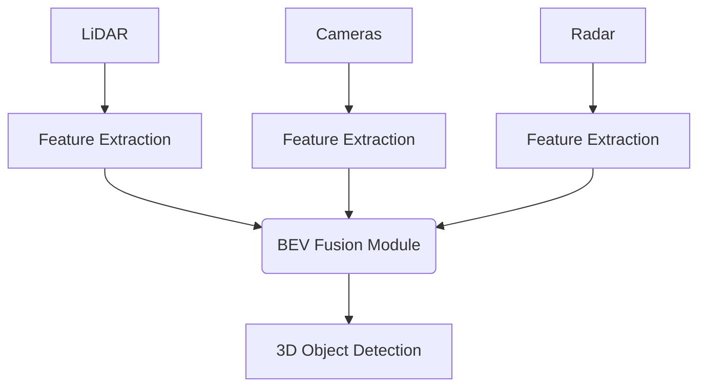

# Autonomous Vehicle Perception Stacks

## Overview
Self-driving cars fuse data from disparate sensors (Cameras, LiDAR, Radar) to create a comprehensive 3D Bird's-Eye View (BEV) representation of the environment, ensuring robustness under various weather conditions.

## Architecture Diagram

