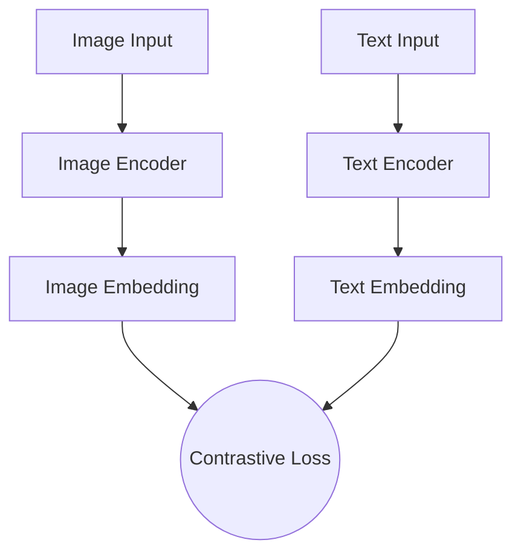

# The Contrastive Alignment Era (CLIP Era)

## Overview
Starting around 2021, popularized by OpenAI's CLIP, the paradigm shifted toward aligning independently processed modalities into a shared representation space. Instead of merging modalities to generate a joint output, models were trained to maximize the cosine similarity between matching text and image pairs.

## Architecture Diagram

