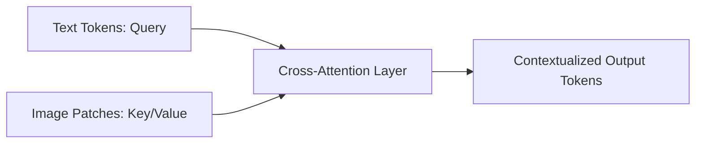

# Cross-Attention Fusion

## Overview
In cross-attention fusion, the self-attention mechanism of Transformers is extended across modalities. One modality acts as the Query, while the other provides the Keys and Values, allowing one stream of information to conditionally process the other.

## Architecture Diagram

