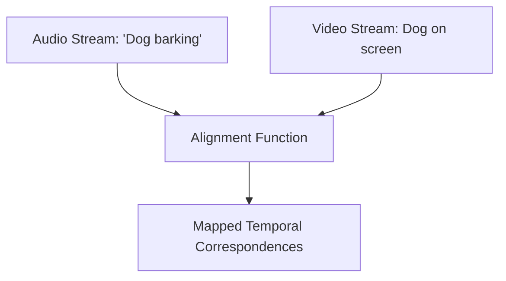

# Cross-Modal Alignment

## Overview
Cross-modal alignment focuses on establishing a direct correspondence between elements of different modalities. A classic example is grounding text phrases to specific bounding boxes in an image or linking spoken words to temporal video frames.

## Architecture Diagram

