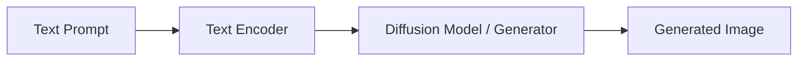

# Cross-Modal Generation (Translation)

## Overview
Cross-modal generation is the process of translating information from one modality to entirely generate data in another modality. Prominent examples include Text-to-Image synthesis using Diffusion models and Image-to-Text generation for captioning.

## Architecture Diagram

