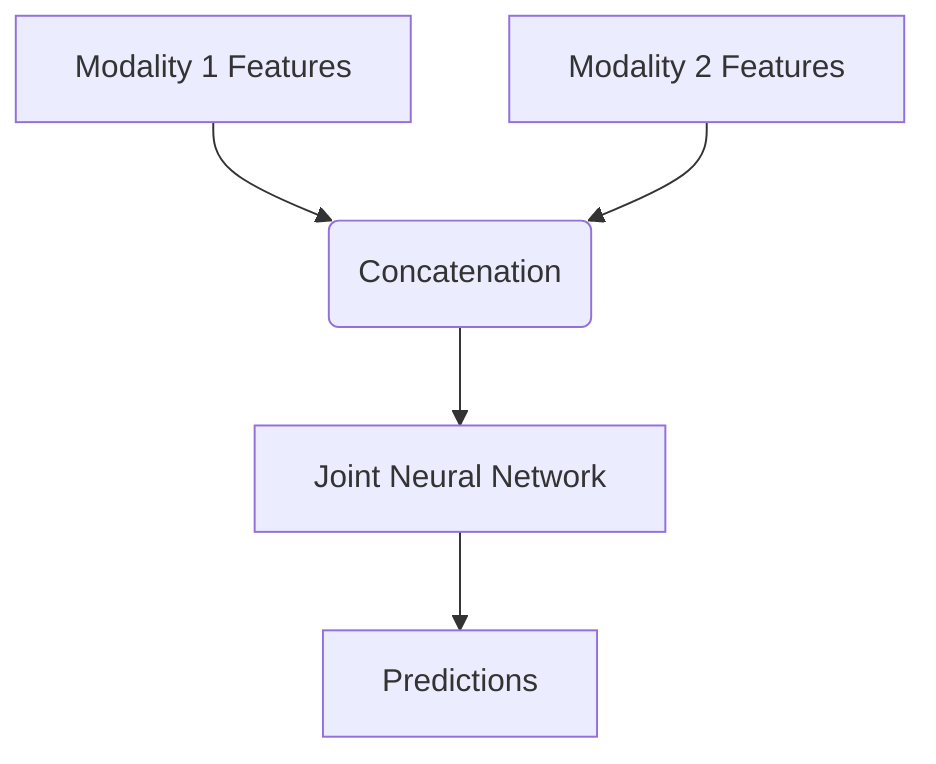

# Early Fusion (Input-Level)

## Overview
Early fusion integrates multi-modal data at the input level by concatenating raw features or initial embeddings before they are processed by the main deep learning model.

## Architecture Diagram

