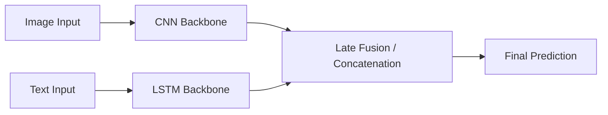

# The Feature Fusion Era (Late 2000s–2010s)

## Overview
During this era, multi-modal learning was heavily reliant on completely separate network backbones for different modalities. For instance, CNNs were exclusively used for extracting image features, while LSTMs were deployed for sequential text data. The extracted features were then fused either very early or very late in the model.

## Architecture Diagram

