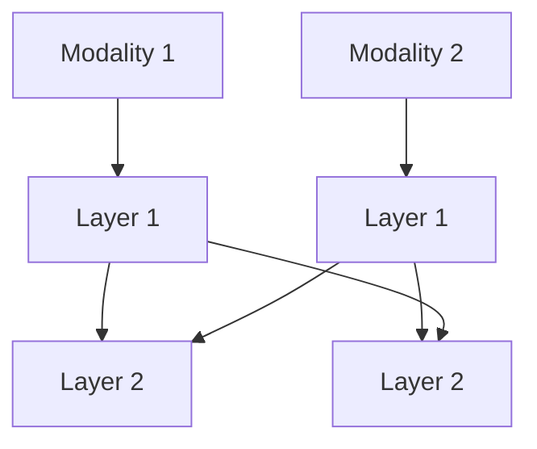

# Intermediate / Hybrid Fusion

## Overview
Intermediate fusion strategies combine features at various depths within a neural network. This allows the model to learn interactions between high-level semantic abstractions as well as low-level physical traits.

## Architecture Diagram

