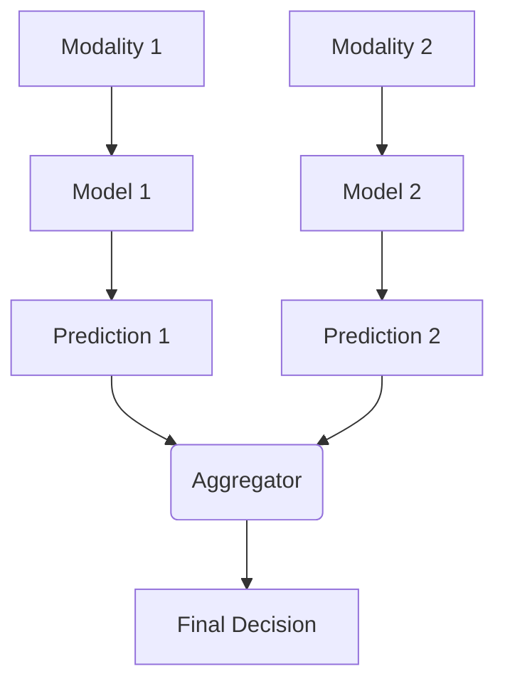

# Late Fusion (Decision-Level)

## Overview
Late fusion keeps modalities completely separate until the very end. Independent models make predictions based on their respective modalities, and the final decision is made by aggregating these predictions (e.g., voting, averaging).

## Architecture Diagram

