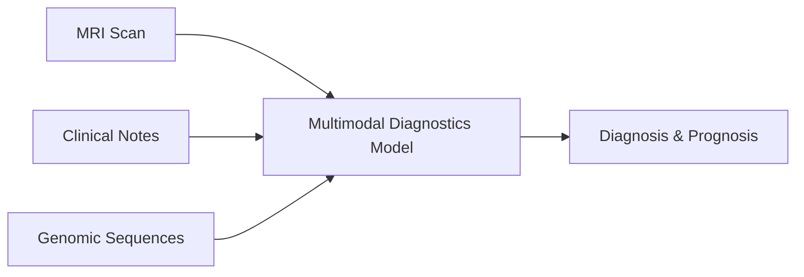

# Multimodal Medical Diagnostics

## Overview
In healthcare, patient records are highly multimodal. By combining structured EHR tables, raw clinical notes, genomic data, and medical imaging (like MRIs or X-Rays), diagnostic systems can achieve far greater accuracy.

## Architecture Diagram

