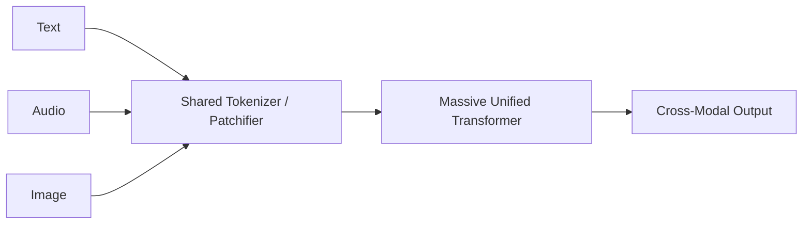

# The Native Unified Token Era (2024+)

## Overview
Modern multi-modal frontier models natively tokenize all modalities (text, audio, image patches) into a single, shared embedding space. A massive Transformer backbone then processes these tokens simultaneously, learning deep cross-modal interactions from the first layer.

## Architecture Diagram

