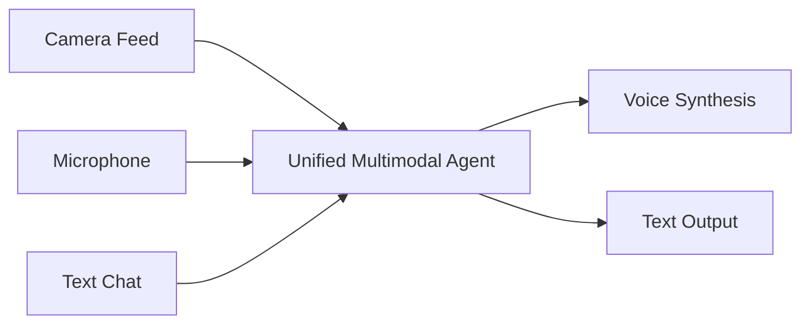

# Omni-Channel Conversational Assistants

## Overview
Modern conversational agents can simultaneously process real-time audio, text, and visual inputs, producing synthesized audio and text responses fluidly without explicit pipelining steps like ASR or TTS.

## Architecture Diagram

